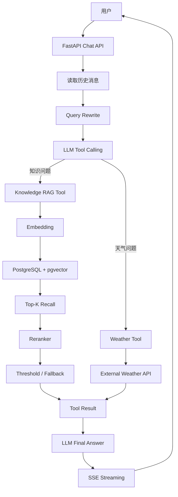
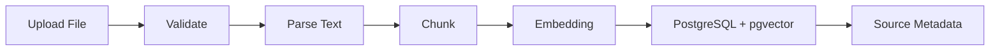

# 企业智能知识库问答系统（RAG + Agent）

基于 **FastAPI + PostgreSQL/pgvector + RAG + Tool Calling** 实现的企业知识库智能问答项目。

项目面向企业内部文档检索与智能问答场景，覆盖知识文件管理、Embedding 向量化、PGVector 向量召回、Reranker 精排、Agent 工具调用、多轮上下文、来源追踪、SSE 流式回答以及 RAG 自动评测等核心流程。

本项目的 RAG 与 Agent 主链路采用原生方式实现，重点用于理解和实践：

```text
Embedding
→ Vector Retrieval
→ Reranker
→ Context Assembly
→ Tool Calling
→ Tool Result
→ LLM Final Answer
```

而不仅是对大模型 API 的简单封装。

---

## 1. 核心功能

### 用户认证与会话管理

- 用户注册、登录
- bcrypt 密码哈希
- JWT 身份认证
- 多会话聊天记录持久化
- 历史会话查询与删除
- 历史消息窗口
- 多轮上下文加载

### 企业知识库管理

支持在线上传：

- TXT
- Markdown
- 文本型 PDF
- DOCX

知识文件入库流程：

```text
文件上传
   ↓
文件校验
   ↓
文本解析
   ↓
Chunk 切分
   ↓
Embedding
   ↓
PostgreSQL + pgvector
```

每个知识 Chunk 保存来源文件、Chunk 序号等 metadata，用于后续检索结果来源追踪。

DOCX支持段落与表格按原始顺序提取，并提供结构化切分与普通 Chunk 切分回退。

对于同名文件重新上传，旧 Chunk 删除与新 Chunk 写入位于同一数据库事务中；全部写入成功后统一提交，异常时执行 rollback，避免知识库出现半更新状态。

### RAG 两阶段检索

核心检索链路：

```text
用户问题
   ↓
Query Rewrite
   ↓
Embedding
   ↓
PGVector Top-K 粗召回
   ↓
Reranker 精排
   ↓
relevance_score 筛选
   ↓
恢复完整原始 Chunk
   ↓
来源追踪
   ↓
LLM 生成最终回答
```

当前默认 RAG 配置包括：

- Embedding：`BAAI/bge-m3`
- 向量维度：1024
- Reranker：`BAAI/bge-reranker-v2-m3`
- 向量距离：Cosine Distance
- 粗召回：Top 10
- Reranker：Top 3
- 相关度阈值：0.25

PGVector首先负责从知识库中获取候选集合，Reranker再针对当前Query和候选文本进行二次相关度排序。

为了控制外部Reranker请求体大小，精排阶段只发送候选Chunk的截断文本；Reranker返回结果后，再利用其原始候选`index`映射回召回阶段保存的完整Chunk，最终将完整知识上下文交给LLM。

### RAG 降级策略

针对外部Reranker服务异常或相关度阈值过严，项目设计了基础降级路径：

```text
正常情况
→ Reranker 精排
→ relevance_score 筛选

精排成功但全部低于阈值
→ 保留 Reranker Top1 作为弹性兜底

Reranker 超时 / 请求异常 / 返回异常
→ 回退 PGVector 粗召回 Top3
```

Reranker属于检索增强组件，因此其故障不会直接导致整个知识检索链路失效。

### Agent 与 Tool Calling

当前Agent提供两个主要工具：

```text
search_knowledge_base
→ 企业知识库 RAG 检索

get_realtime_weather
→ 实时天气查询
```

Agent对话链路：

```text
用户问题
   ↓
读取历史消息
   ↓
Query Rewrite
   ↓
LLM Tool Calling 决策
   ↓
执行 Knowledge Tool / Weather Tool
   ↓
Tool Result
   ↓
以 role="tool" 加入上下文
   ↓
LLM 生成最终回答
   ↓
SSE 流式返回
```

对于知识型问题，System Prompt明确约束模型优先通过企业知识库获取事实。

同时在LLM决策层增加代码级RAG兜底：当模型未产生Tool Call时，程序构造`search_knowledge_base`工具调用，进一步降低模型脱离企业知识资料直接使用预训练知识作答的概率。

### 多轮 Query Rewrite

系统读取近期聊天历史，并结合当前用户问题进行Query Rewrite。

例如：

```text
用户：
公司的年假有多少天？

用户继续追问：
那试用期呢？
```

第二个问题本身信息不足。

通过历史消息和Query Rewrite，可将其转换为更完整的检索Query，再进入知识库检索，提高多轮追问场景下的召回稳定性。

### SSE 流式回答

聊天接口基于FastAPI `StreamingResponse`返回SSE数据。

前端逐段接收：

```text
data: {"content": "..."}
```

回答结束：

```text
data: [DONE]
```

系统同时记录模型响应耗时等运行信息，最终完整助手回答写入聊天历史。

---

## 2. 系统架构



---

## 3. 知识库入库链路



支持文件：

```text
.txt
.md
.pdf
.docx
```

当前PDF解析基于文字层提取，不包含OCR能力，因此扫描图片型PDF需要额外OCR方案。

---

## 4. 技术栈

### Backend

- Python 3.11+
- FastAPI
- SQLAlchemy 2.0 Async
- asyncpg
- PostgreSQL
- pgvector
- Pydantic Settings

### AI / RAG

- OpenAI-compatible Chat Model API
- BAAI/bge-m3
- BAAI/bge-reranker-v2-m3
- Query Rewrite
- Vector Retrieval
- Reranker
- RAG
- Tool Calling
- SSE Streaming

### Engineering

- httpx
- JWT / PyJWT
- bcrypt
- Loguru
- python-multipart
- pypdf
- python-docx
- Python unittest

### Frontend

- HTML
- CSS
- JavaScript
- marked.js

> Chat Model通过OpenAI兼容接口接入，可根据环境变量切换兼容服务与具体模型。

---

## 5. 项目结构

```text
ai_rag_project/
├── clients/
│   └── llm_client.py
│
├── routers/
│   ├── auth.py
│   ├── chat.py
│   └── knowledge.py
│
├── services/
│   ├── agent_service.py
│   ├── auth_service.py
│   ├── knowledge_service.py
│   └── memory_service.py
│
├── tools/
│   ├── rag_tool.py
│   └── weather_tool.py
│
├── utils/
│   ├── background_tasks.py
│   ├── exception_handlers.py
│   ├── logger.py
│   └── text_splitter.py
│
├── tests/
│   ├── fixtures/
│   │   └── rag_eval/
│   ├── test_docx_section_chunking.py
│   ├── test_docx_table_extraction.py
│   ├── test_exception_handlers.py
│   └── test_text_pdf_parsing.py
│
├── evaluation/
│   ├── fixtures_manifest.md
│   ├── rag_evaluation_questions.csv
│   └── run_rag_baseline.py
│
├── config.py
├── database.py
├── main.py
├── models.py
├── schemas.py
├── security.py
├── web_ui.html
│
├── .env.example
├── .gitignore
├── requirements.txt
└── README.md
```

Docker相关文件将在完成实际容器化验证后加入仓库。

---

## 6. 核心数据模型

### User

保存用户账号信息：

```text
id
username
hashed_password
created_at
```

### Document

保存知识库Chunk：

```text
id
content
embedding Vector(1024)
metadata_info JSONB
created_at
```

其中`metadata_info`用于保存：

```text
source
file_type
chunk_index
...
```

等知识来源信息。

### ChatMessage

保存用户与助手聊天记录：

```text
id
user_id
session_id
role
content
created_at
```

---

## 7. 主要 API

| Method | Endpoint | Description |
|---|---|---|
| POST | `/api/auth/register` | 用户注册 |
| POST | `/api/auth/login` | 用户登录并获取JWT |
| POST | `/api/chat/completions` | SSE流式AI对话 |
| GET | `/api/chat/sessions` | 获取历史会话 |
| GET | `/api/chat/history/{session_id}` | 获取指定会话历史 |
| DELETE | `/api/chat/sessions/{session_id}` | 删除指定会话 |
| POST | `/api/knowledge/upload` | 上传知识文件 |
| GET | `/api/knowledge/documents` | 获取知识库文件列表 |
| DELETE | `/api/knowledge/documents/{file_name}` | 删除知识文件 |

后端启动后可访问：

```text
http://127.0.0.1:8000/docs
```

查看Swagger API文档。

---

## 8. 本地运行

### 环境要求

需要准备：

```text
Python >= 3.11
PostgreSQL
pgvector extension
```

同时需要能够访问配置的大模型、Embedding、Reranker及天气服务。

### 克隆项目

```bash
git clone https://github.com/yangmingzhou2759678997/ai_rag_project.git
cd ai_rag_project
```

### 创建虚拟环境

Windows PowerShell：

```powershell
python -m venv .venv
.\.venv\Scripts\Activate.ps1
```

macOS / Linux：

```bash
python -m venv .venv
source .venv/bin/activate
```

### 安装依赖

```bash
pip install -r requirements.txt
```

### 配置环境变量

项目提供：

```text
.env.example
```

复制为：

```text
.env
```

Windows PowerShell：

```powershell
Copy-Item .env.example .env
```

macOS / Linux：

```bash
cp .env.example .env
```

然后根据自己的运行环境填写：

- 大模型API
- Embedding / Reranker配置
- PostgreSQL连接信息
- JWT Secret
- CORS Origin
- 其他外部服务配置

> `.env`中包含API Key、数据库密码和JWT Secret等敏感信息，不应提交到Git仓库。

### PostgreSQL启用pgvector

连接目标数据库后执行：

```sql
CREATE EXTENSION IF NOT EXISTS vector;
```

项目启动时会通过SQLAlchemy创建当前不存在的数据表。

当前尚未接入Alembic，因此数据库Schema出现正式版本变化时，需要另外处理数据库迁移。

### 启动FastAPI

```bash
uvicorn main:app --host 0.0.0.0 --port 8000
```

开发环境可使用：

```bash
uvicorn main:app --host 0.0.0.0 --port 8000 --reload
```

打开：

```text
http://127.0.0.1:8000/docs
```

即可访问Swagger。

### 启动前端

另开一个终端，在项目根目录执行：

```bash
python -m http.server 3000
```

浏览器访问：

```text
http://127.0.0.1:3000/web_ui.html
```

---

## 9. CORS 配置

项目通过：

```text
CORS_ALLOW_ORIGINS
```

配置允许访问后端的前端Origin。

本地开发例如：

```env
CORS_ALLOW_ORIGINS=http://localhost:3000,http://127.0.0.1:3000,http://127.0.0.1:8000
```

### 部署注意事项

部署至Docker或云服务器后，必须将**真实前端Origin**加入`CORS_ALLOW_ORIGINS`。

例如前端最终运行在：

```text
http://your-server-ip
```

或：

```text
https://your-domain.com
```

则需要根据实际部署地址修改CORS配置。

> 生产部署时不要仅保留`localhost`地址，也不建议长期使用`allow_origins=["*"]`与凭据访问组合。

---

## 10. 知识库使用

登录以后，可通过知识库接口或Web页面上传：

```text
TXT
Markdown
PDF
DOCX
```

上传流程：

```text
Upload
→ Parse
→ Chunk
→ Embedding
→ Vector Store
```

查询时无需再通过离线seed脚本灌入固定资料。

同名文件再次上传时，会替换该文件原有的知识Chunk。

知识文件也支持：

- 查询文件列表
- 删除指定文件
- 来源追踪

---

## 11. 自动化测试

项目测试主要覆盖：

- TXT文本提取
- PDF文本提取
- DOCX文本处理
- DOCX表格顺序提取
- DOCX结构化切分
- Chunk切分
- 异常响应

运行全部测试：

```bash
python -m unittest discover -s tests -v
```

也可以运行指定测试模块：

```bash
python -m unittest tests.test_text_pdf_parsing -v
python -m unittest tests.test_docx_section_chunking -v
python -m unittest tests.test_docx_table_extraction -v
python -m unittest tests.test_exception_handlers -v
```

部分依赖外部真实测试文件路径的测试，在未提供对应环境变量时会自动跳过。

---

## 12. RAG 评测

项目保留固定RAG评测资料说明、评测问题集及端到端评测脚本：

```text
evaluation/
├── fixtures_manifest.md
├── rag_evaluation_questions.csv
└── run_rag_baseline.py
```

问题集主要覆盖：

- 基础事实检索
- 数字 / 编号 / 命令
- 多Chunk信息
- 多文件相似字段
- 多轮Query Rewrite
- 知识库外问题拒答
- 来源命中

评测脚本记录：

- HTTP状态
- 最终回答
- 返回来源
- 必需关键词
- 禁止关键词
- 来源命中
- 拒答结果
- 总响应耗时

运行前确保：

1. FastAPI已经启动；
2. 测试账号存在；
3. `fixtures_manifest.md`中要求的固定测试资料已经上传至知识库。

执行：

```bash
python evaluation/run_rag_baseline.py
```

运行指定问题：

```bash
python evaluation/run_rag_baseline.py --questions Q001,Q024,Q038
```

运行结果在本地生成：

```text
evaluation/rag_baseline_results.csv
```

该文件属于当前代码与模型配置下的运行结果，默认通过`.gitignore`忽略，不作为仓库中的固定性能指标。

---

## 13. 核心设计说明

### 为什么采用“向量召回 + Reranker”？

PGVector主要解决：

> 从大量知识Chunk中快速找到一批候选内容。

Reranker主要解决：

> 当前问题与候选Chunk之间谁更加相关。

因此项目将Recall与Ranking拆开：

```text
Query
   ↓
Vector Recall
   ↓
Candidate Chunks
   ↓
Reranker
   ↓
Final Context
```

这种方式既保留向量召回的候选覆盖能力，也能通过精排进一步改善最终上下文排序。

### 为什么需要Reranker异常降级？

Reranker属于外部增强组件。

如果其超时或请求异常，但PGVector已经获得候选内容，直接让整个RAG请求失败并不合理。

因此当前策略是：

```text
Reranker正常
→ 使用精排结果

Reranker异常
→ 使用PGVector Top3候选
```

优先保证知识检索链路仍然可用。

### 为什么Reranker只接收截断文本？

直接把所有完整Chunk全部发送给外部Reranker会增加：

- 请求体大小
- 网络传输成本
- 服务响应时间

因此精排阶段使用候选文本的截断版本。

Reranker返回原始候选`index`后，再映射到召回阶段保存的完整Chunk：

```text
recall_items
   ↓
safe candidate text
   ↓
Reranker
   ↓
result.index
   ↓
recall_items[result.index]
   ↓
完整 Chunk
```

### 为什么主RAG/Agent链路没有直接使用LangChain？

本项目主链路选择直接使用OpenAI兼容API、SQLAlchemy和pgvector实现，主要目的是完整理解：

```text
Embedding
Retriever
Reranker
Context
Tool Calling
Tool Result
Final Answer
```

等核心数据流。

在理解底层链路后，再使用LangChain进行RAG和Agent实践，可以更清楚地理解框架中的Model、Retriever、Tool、Agent等抽象到底封装了什么。

---

## 14. 当前项目边界

本项目定位为 **AI应用开发与技术实践项目**，并非完整企业生产系统。

当前主要边界包括：

- PDF主要支持带文字层文件，暂未集成OCR；
- 知识库目前以系统共享知识为主，未实现完整用户级知识空间隔离；
- 数据库Schema目前通过SQLAlchemy创建，尚未接入Alembic迁移体系；
- 检索目前以向量召回 + Reranker为主，尚未加入BM25等混合检索；
- 前端采用原生HTML / CSS / JavaScript，项目重点放在AI后端链路；
- 完整生产环境仍需要进一步完善监控、HTTPS、部署安全与资源治理。

---

## 15. 安全说明

请勿将以下信息提交到Git仓库：

```text
.env
API Key
数据库密码
JWT Secret
其他真实访问凭证
```

项目通过`.gitignore`忽略：

- `.env`
- Python虚拟环境
- Python缓存
- IDE配置
- 日志文件
- 本地生成的评测结果

如果真实密钥曾进入公开Git历史，应立即撤销并重新生成，而不是只删除当前文件。

---

## 16. 项目定位

这是一个围绕企业知识库场景构建的个人AI应用项目。

重点实践：

```text
Python异步后端
+
大模型API集成
+
Embedding
+
PostgreSQL / pgvector
+
RAG两阶段检索
+
Reranker
+
Agent Tool Calling
+
多轮上下文
+
SSE流式响应
+
测试与评测
```

目标是通过实际代码理解企业AI应用从“调用大模型API”进一步发展到“可检索、可追踪、可调试、具备基础工程能力”的完整过程。